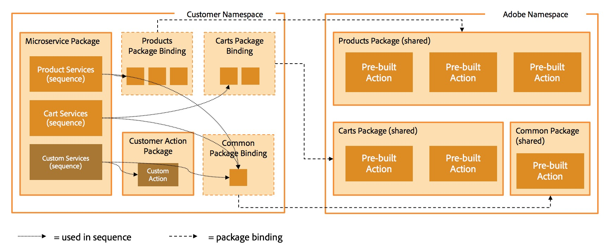
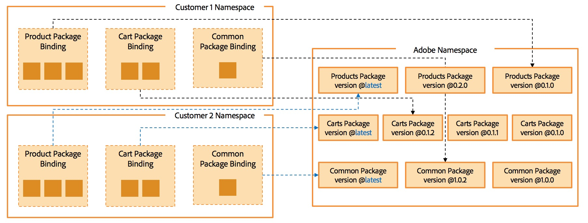

# Concepts

## Namespaces

The namespace is the private area of a customer, which will then be used in the URLs and API calls. For example, URLs for Adobe I/O Runtime follow a pattern such as: 

`https://runtime-preview.adobe.io/api/v1/experimental/web/<namespace>/<package>/<action>.http(? query parameters)`

For more information, have a look at the [OpenWhisk system details](https://github.com/apache/incubator-openwhisk/blob/master/docs/reference.md).

## Packaging and Binding

Packages are used to manage logical groups of actions. Customers use predefined actions from Adobe or partners via shared packages. A package is our representation of a 'microservice domain'.

The Adobe namespace (and partner namespaces as well) act as a library which provides packages and actions to be reused by customers. Customers can use these modules if they link them into their organization (namespace). 
The process is called binding. During that step the customers have to provide their input for the required parameters, such as commerce system endpoints, backend API keys, and so on. This allows to use same packages/actions shared by Adobe to be used by different customers.

Within the customer namespace the REST endpoints for the commerce services are provided by using web actions, which are implemented as sequences. They orchestrate the actions provided by Adobe and additional custom actions into a microservice. Therefore, all REST endpoints are customer-specific, within the customer's namespace.

## Versioning

Each commerce domain functions are oragnized in a shared package, which is versioned separately. CIF Cloud uses a versioning pattern with is inspired by the JavaScript NPM version schema.

It is important to know which version of an action is used and exposed to the public via the REST API.
Potentially, there can be multiple co-existing versions of a library, and you have to decide which version to use and expose via the REST API.

For example, if package 1.0.0 has a minor bug fixed in version 1.0.2 that doesn't introduce any backwards compatibility issue, you can decide to change the forwarding rule of its REST API, and use the new version by changing the mapping.

You could as well still use version 1.0.0, because introducing new versions of an action never introduces the risk of breaking existing code, as long as the REST API mappings are not changed.
