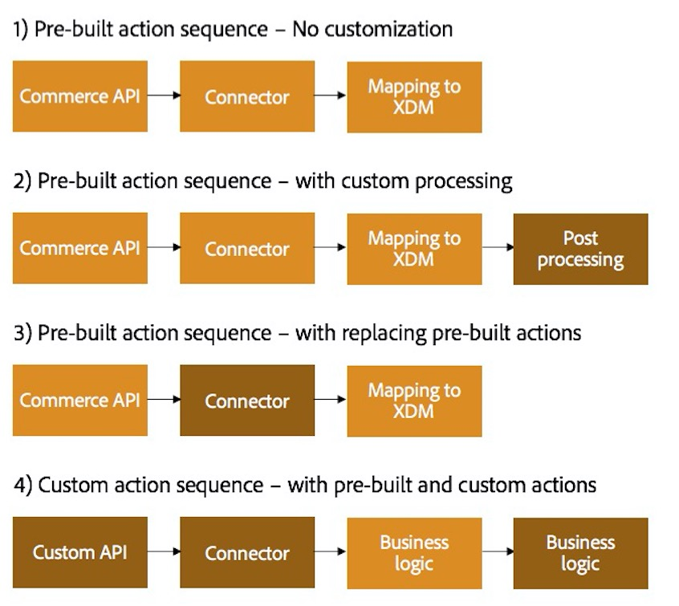

# Customization Patterns

CIF Cloud provides a standardized commerce API that is usable by other Adobe Marketing Cloud solutions. You can use it with minimal configuration and customer code customization is optional.

There are several possibilities, depending on the needs of the customer. 
We will describe 4 use cases as examples, illustrated by the following diagrams:

### 1) No Customization

You can use CIF Cloud out-of-the-box. By default, there is a set of microservices that you can use.

> Note: This is the initial state that every customer gets during the provisioning.

### 2) With Custom Processing

You can add your own custom actions to the actions sequence. You do not change existing actions that are delivered with CIF Cloud, but you can modify the order of actions and add pre-processing or post-processing steps.

> Note: This is the recommended customization pattern if CIF Cloud customization is needed.

#### Example:
Imagine you are only operating in a particular country. You can add pre-validation by checking the zip code of a store locator service, and if it is not in the country you have your store in, you would send an error and the rest of the sequence would not be called.

### 3) With Replacing pre-built actions

You get predeployed actions with CIF Cloud but you might need to use your own connector or customize it.

#### Example:
For example if don't maintain your inventory in the commerce system directly, but in some other logistics system that we are not providing a connector for, you could need to have another connector.

> Note: This customization could be combined with the previous one and you could add pre-processing or post-processing steps here too.

### 4) With pre-built and custom actions

If there are features that are not implemented at the moment and that you need, you could consider using your own API that you could combine with the actions that come from the default integration. You should consider this only if it really makes sense for your use case.
