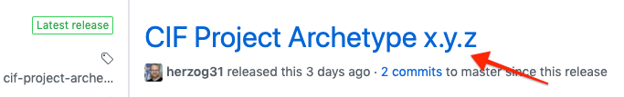
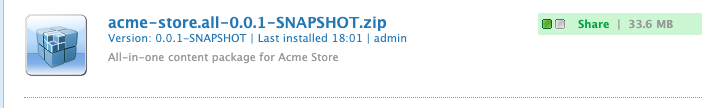
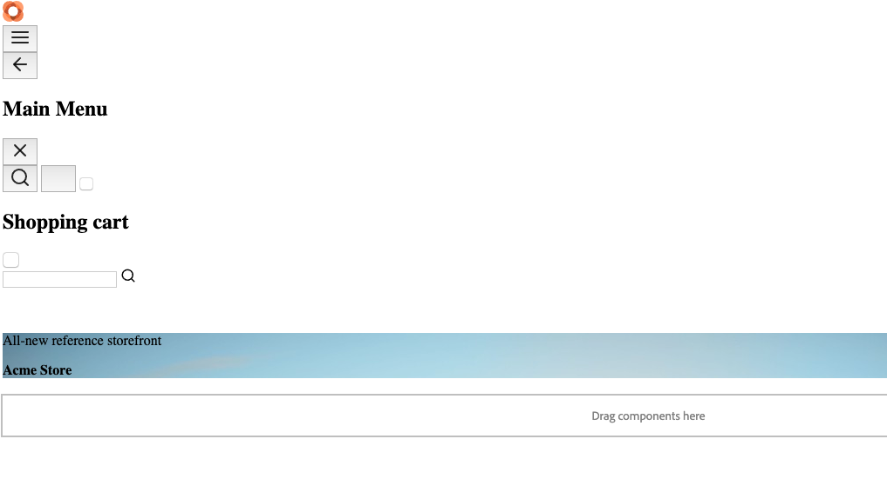
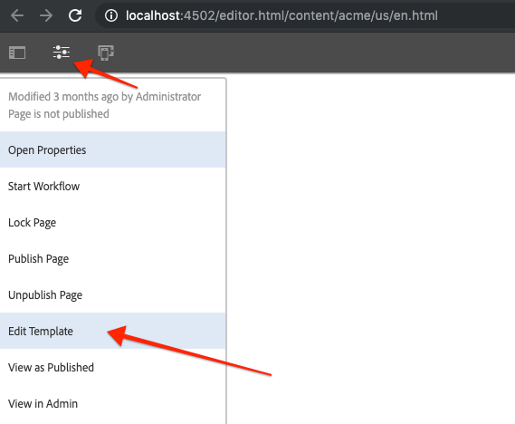
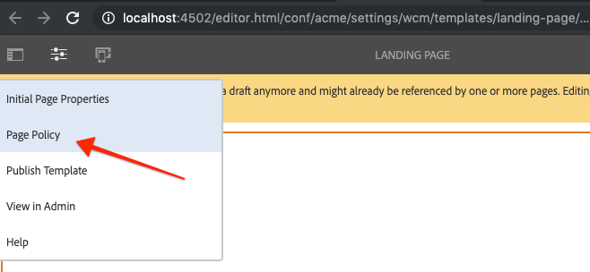
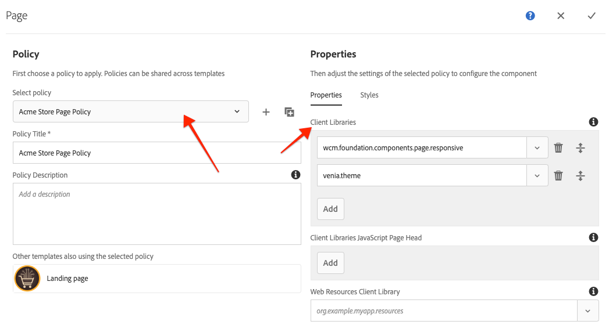
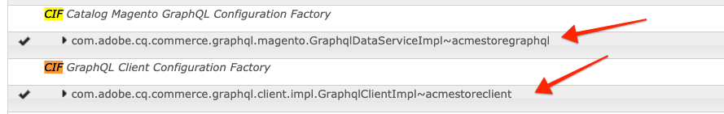
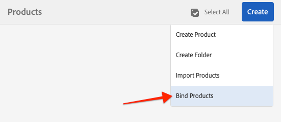
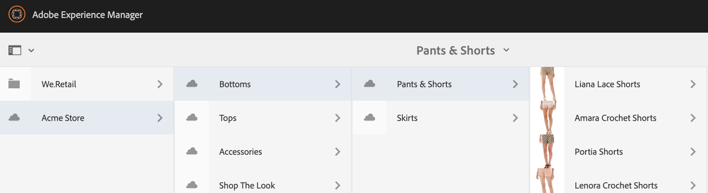
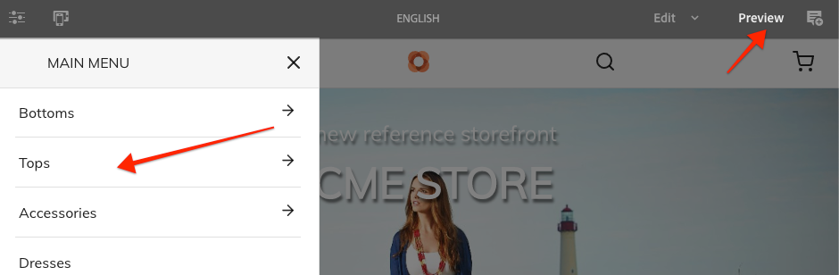

# Creating a new AEM CIF Project

The [CIF Project archetype](https://github.com/adobe/aem-cif-project-archetype) creates a minimal Adobe Experience Manager (AEM) CIF project as a starting point for customer projects using [CIF Core Components](https://github.com/adobe/aem-core-cif-components). The CIF Project archetype should be used for new projects looking to integrate AEM and Magento using the Commerce Integration Framework. The CIF Project archetype can also serve as a useful reference for existing AEM projects looking to add the CIF related dependencies.

In this guide we will generate a new AEM CIF project using the CIF Project archetype and explore how to use it.

## Background

**What is a Maven project?** - [Apache Maven](https://maven.apache.org/) is a software management tool to build projects. All AEM implementations use Maven projects to build, manage and deploy custom code on top of AEM.

**What is a Maven archetype?** - A [Maven archetype](https://maven.apache.org/archetype/index.html) is a template or pattern for generating new projects. The CIF Project archetype allows us to generate a new project with a custom namespace and include a project structure that follows best practices.

## Prerequisites

The following tools and technologies are required:

* [Java 1.8](https://www.oracle.com/technetwork/java/javase/downloads/index.html) or [Java 11](https://www.oracle.com/technetwork/java/javase/downloads/jdk11-downloads-5066655.html) (AEM 6.5+ only)
* [Apache Maven](https://maven.apache.org/) (3.3.9 or newer)
* Adobe Experience Manager
  * [AEM 6.5](https://helpx.adobe.com/experience-manager/6-5/sites/deploying/using/technical-requirements.html)
  * [AEM 6.4.4+](https://helpx.adobe.com/experience-manager/6-4/release-notes/sp-release-notes.html)

It is also considered a best practice to include the Adobe Public Maven Repository in your Maven settings. This file, commonly found at `~/.m2/settings.xml` can be updated following this [Knowledge Base](https://helpx.adobe.com/experience-manager/kb/SetUpTheAdobeMavenRepository.html) article.

## Generate the project

1. Determine the latest version of the CIF Project Archetype by viewing [the latest release on GitHub](https://github.com/adobe/aem-cif-project-archetype/releases/latest).

    

    This should be a 3-digit version number. For the purposes of this guide, any time you see `x.y.z` replace with the latest version you see on GitHub, i.e **0.3.0**, ***0.5.0***, ect...

    > The next series of steps will take place using a UNIX based command line  terminal,  but should be similar if using a Windows terminal.

2. Verify that Maven is correctly installed and available from the command line:

    ```shell
    $ mvn -version
      Apache Maven 3.3.9
      Maven home: /Library/apache-maven-3.3.9
      Java version: 11.0.2, vendor: Oracle Corporation
      Java home: /Library/Java/JavaVirtualMachines/jdk-11.0.2.jdk/Contents/Home
    ```

3. Navigate to a directory, i.e a source folder, in which you want to generate the project:

    ```shell
    $ cd ~/src
    ```

4. Copy+Paste the following command to initiate the creation of a new project in interactive mode. Replace `x.y.z` with the **latest** release version number from **Step 1**.

    ```shell
    mvn archetype:generate \
    -DarchetypeGroupId=com.adobe.commerce.cif \
    -DarchetypeArtifactId=cif-project-archetype \
    -DoptionEmbedConnector=y \
    -DarchetypeVersion=x.y.z
    ```

5. The CIF Project Archetype will prompt a series of parameters to generate the project. For the sake of this tutorial and in order to see the effects of the different parameters we will generate the project for the fictitious **Acme Corporation**. Naturally, when generating a customer project you would use values that match the company/customer name.

    Use the following values:

    | Name                  | Value                | Description                        |
    | --------------------- | -------              | ---------------------------------- |
    | groupId               | **com.acme.cif**     | Base Maven groupId                 |
    | appsFolderName        | **acme**             | `/apps` folder name                |
    | artifactId            | **acme-store**       | Base Maven ArtifactId              |
    | version               | **0.0.1-SNAPSHOT**   | Version                            |
    | package               | **com.acme.cif**     | Java Source Package                |
    | artifactName          | **Acme Store**       | Maven Project Name                 |
    | componentGroupName    | **Acme.Content**     | AEM component group name           |
    | confFolderName        | **acme**             | `/conf` folder name                |
    | contentFolderName     | **acme**             | `/content` folder name             |
    | optionAemVersion      | *6.5.0*              | Target AEM version                 |
    | optionEmbedConnector  | *y*                  | Embed CIF connector (see note)     |
    | optionIncludeExamples | *y*                  | Include Sample Content Package     |
    | packageGroup          | **acme**             | Content Package Group name         |
    | siteName              | **Acme Store**       | AEM site name                      |

    > Note: The **optionEmbedConnector** defaults to false. We have *explicitly* set it to true by adding the parameter `-DoptionEmbedConnector=y \` in **Step 4**. For simplicity we are embedding [CIF Connector](https://github.com/adobe/commerce-cif-connector) as part of the project. This practice is recommended for on-premise deployments **only**. 
    >
    > If planning on using [Cloud Manager](https://docs.adobe.com/content/help/en/experience-manager-cloud-manager/using/introduction-to-cloud-manager.html) and/or AMS you should **not** embed the connector. See the [usage](https://github.com/adobe/aem-cif-project-archetype#usage) instructions for more details. Note that the archetype parameters simply provide a *starting* point for projects. You can always modify the dependencies and build process later by updating the `pom.xml` files.

6. The following folder and file structure will be generated by the archetype:

    ```plain
    ~/src/
        |--- acme-store/
              |--- all/
              |--- core/
              |--- samplecontent/
              |--- ui.apps/
              |--- ui.content/
              |--- README.md
              |--- pom.xml
    ```

    * **pom.xml** - Considered the Parent Reactor POM. This file deploys the maven modules and manages dependency versions.
    * **core** - Java bundle containing all core functionality like Sling Models, OSGi services, and other component related Java code such as servlets or request filters.
    * **ui.apps** - contains the `/apps` part of the project, including proxy components for CIF core components and WCM Core Components.
    * **ui.content** - contains structural content and configurations (`/content`, `/conf`) including CIF templates like catalog template, category template, and search result template.
    * **samplecontent** - contains some sample assets and pages to get started. Once a project reaches maturity, this module can be removed and **should be removed** prior to production.
    * **all** - combines all of the sub-modules and CIF dependencies into a single package that can be installed to a local AEM instance. Note that this folder by design does not actually contain anything but a single `pom.xml` file.

## Build the project

Now that we have generated a new project, we can deploy the project code to a local instance of AEM.

1. Ensure you have an instance of AEM running locally on port **4502**.
2. From the command line navigate into the `acme-store` project directory:

    ```shell
    $ cd acme-store/
    ```

3. Run the following command to build and deploy the entire project to AEM:

    ```shell
    $ mvn clean install -PautoInstallAll

    ...

    Package installed in 6388ms.
    [INFO] ------------------------------------------------------------------------
    [INFO] Reactor Summary:
    [INFO]
    [INFO] acme-store ......................................... SUCCESS [  0.306 s]
    [INFO] Acme Store - Core .................................. SUCCESS [  7.399 s]
    [INFO] Acme Store - UI apps ............................... SUCCESS [  3.211 s]
    [INFO] Acme Store - UI content ............................ SUCCESS [  1.069 s]
    [INFO] Acme Store - Sample Content ........................ SUCCESS [  2.257 s]
    [INFO] Acme Store - All-in-one package .................... SUCCESS [  8.572 s]
    [INFO] ------------------------------------------------------------------------
    [INFO] BUILD SUCCESS
    [INFO] ------------------------------------------------------------------------
    [INFO] Total time: 24.882 s
    [INFO] Finished at: 201X-XX-XX
    [INFO] Final Memory: 46M/167M
    [INFO] ------------------------------------------------------------------------
    ```
  
    Since we ran the maven command at the root of the project, all sub-modules of the project are built. Maven goals of `clean` and `install` cause existing artifacts to be removed and re-compiled. The profile `autoInstallAll` part of the **all** module and is used to package up all of the modules into a single AEM package that is deployed.

4. Navigate to AEM to view the deployed packages: [http://localhost:4502/crx/packmgr/index.jsp](http://localhost:4502/crx/packmgr/index.jsp).

    Search for the package **acme-store.all-0.0.1-SNAPSHOT.zip**:

    

    Many more packages were installed than just the **acme-store.all-0.0.1-SNAPSHOT.zip** package. This is because the **acme-store.all-0.0.1-SNAPSHOT.zip** embedded multiple sub-packages within it. Some of these sub-packages even included sub-sub-packages! Luckily the archetype took care of setting up these dependencies for us.

    Below are the important packages that were installed that you should be aware of:

    ### Project Packages

    * `acme-store.ui.apps-0.0.1-SNAPSHOT.zip` - This is the compiled package from the **ui.apps** module generated by the archetype. All of the components and customizations related to the Acme store project will be managed here.
    * `acme-store.ui.content-0.0.1-SNAPSHOT.zip` - This is the compiled package from the **ui.content** module generated by the archetype. All of the configurations and policies related to the Acme store project will be managed here.
    * `acme-store.samplecontent-0.0.1-SNAPSHOT.zip` - This is the compiled package from the **samplecontent** module. Keep in mind this module is intended to be used just in the beginning of a project.

    ### Commerce Dependency Packages
  
    * `core.wcm.components.all-x.y.z.zip` - [AEM WCM Core Components](https://github.com/adobe/aem-core-wcm-components) are a standardized set of web content management components like Text, Image, and List. These components are used across AEM implementations.
    * `core-cif-components-all-x.y.z.zip` - [AEM CIF Core Components](https://github.com/adobe/aem-core-cif-components) are a standardized set of commerce components for integrating AEM, CIF, and Magento.
    * `cif-connector-content-x.y.z.zip` - [AEM CIF Connector](https://github.com/adobe/commerce-cif-connector) provides an AEM Commerce connector for Magento and GraphQL and authoring tools.

5. Navigate to the AEM Sites Console to view the sample content: [http://localhost:4502/sites.html/content/acme/us](http://localhost:4502/sites.html/content/acme/us)

    

    If you have followed the video on the [Getting Started AEM - Magento Integration](01-getting-started.md) and installed the [Venia Demo Store Project](https://github.com/adobe/aem-cif-project-archetype/releases/tag/latest) this structure should look familiar. This is because the **samplecontent** installed with the archetype is the same content that the Venia Demo Store project uses. Now that we have our own AEM project, with a custom namespace, we can use the Venia Store as a base and begin to customize the project to meet our needs.

## Apply Default Theme

1. Open the US `>` English page: [http://localhost:4502/editor.html/content/acme/us/en.html](http://localhost:4502/editor.html/content/acme/us/en.html). You may see an un-styled page like the following:

    

    Currently no CSS is being applied to the site. AEM [Client-Side](https://helpx.adobe.com/experience-manager/6-5/sites/developing/using/clientlibs.html) or clientlibs for short are the recommended way to load CSS and Javascript on to the site. The CIF Project is designed to make it easy for implementing projects to add unique brand styles to the project. Next we will apply the Venia Theme so we have a default style for the site.

2. Open the Template associated with the English page by clicking the **Page Menu icon** `>` **Edit Template**.

    

    This will open the Landing Page template: [http://localhost:4502/editor.html/conf/acme/settings/wcm/templates/landing-page/structure.html](http://localhost:4502/editor.html/conf/acme/settings/wcm/templates/landing-page/structure.html).

3. On the Landing Page template, click the **Page Menu icon** `>` **Page Policy** item to open up the Page policies for the template.

    

4. In the Page Policy dialog select from the dropdown the **Acme Store Page Policy**. This will auto-populate the Client Libraries selection to include **wcm.foundation.components.page.responsive** and **venia.theme**.

    

    * **wcm.foundation.components.page.responsive** is responsible for including AEM's responsive grid CSS files and allows for using the editor's [Layout mode](https://helpx.adobe.com/experience-manager/6-5/sites/authoring/using/responsive-layout.html) feature.

    * **venia.theme** is the default theme for the Venia demo storefront. The CSS files for these files are actually included in the Acme store project in the **ui.apps** folder. You can view these files at `ui.apps/src/main/content/jcr_root/apps/acme/clientlibs/theme`.

    Click the **checkbox** in the upper right to save your changes.

5. Return to English Home page: [http://localhost:4502/editor.html/content/acme/us/en.html](http://localhost:4502/editor.html/content/acme/us/en.html). You should now see the familiar Venia styles applied.

    

6. Other pages, like Category and Product, use different templates. Repeat the above steps for all of the templates at [http://localhost:4502/libs/wcm/core/content/sites/templates.html/conf/venia](http://localhost:4502/libs/wcm/core/content/sites/templates.html/conf/venia) to apply the Venia style everywhere.

## Add Magento Configurations

At this point the [Acme storefront](http://localhost:4502/editor.html/content/acme/us/en.html) does not render any products or categories. While the archetype does a lot of heavy lifting for us, it does **not** include the configurations needed to bind a Magento store. Aspects of these configurations will be unique to each customer.

If you have followed the video on the [Getting Started AEM - Magento Integration](01-getting-started.md) you'll know that these configurations can be done via the AEM web UI. Now that we have generated our own project we can add these configurations directly to the project. Adding these configurations to the project will eliminate the need to manually setup the integration every time we start a new instance of AEM and ensure consistency across environments.

In the following steps we will be adding modifying several files in the generated project beneath `acme-store` (where you generated the project on the file system). You can use your favorite text-editor or import the Maven project using an [IDE like Eclipse, IntelliJ or Visual Studio Code](https://helpx.adobe.com/experience-manager/kt/platform-repository/using/local-aem-dev-environment-article-setup.html#setup-integrated-env).

### Add OSGi Configurations

1. Beneath `ui.apps/src/main/content/jcr_root/apps/acme` add a new folder named `config`

    ```diff
      /ui.apps
        ...
          /apps
            /acme
              /components
    +         /config
    ```

    > AEM uses the notion of [Run Modes](https://helpx.adobe.com/experience-manager/6-5/sites/deploying/using/configure-runmodes.html) to define specific configurations for specific environments. The easiest way to target different environments is via the folder name. In this case *config* will apply to all environments. You can create additional run-modes with different folder names to target different environments. More [details can be found here](https://helpx.adobe.com/experience-manager/6-5/sites/deploying/using/configure-runmodes.html#Definingconfigurationpropertiesforarunmode). This may be useful if you wish to have different Magento configurations based on Author vs. Publish or Dev/QA vs. Production.

2. Create a new XML file beneath the `/config` folder named: `com.adobe.cq.commerce.graphql.client.impl.GraphqlClientImpl-acmestoreclient.xml`

    ```diff
      /ui.apps
        ...
          /apps
            /acme
              /components
              /config
    +             com.adobe.cq.commerce.graphql.client.impl.GraphqlClientImpl-acmestoreclient.xml
    ```

    > Note the suffix of `-acmestoreclient` to the name of the file. The `GraphqlClientImpl` is an OSGi Configuration Factory and allows for multiple configurations. You can add more configurations, you just need to ensure that each has a unique suffix so that AEM doesn't get confused during installation. More details about [OSGi Configuration with files can be found here](https://helpx.adobe.com/experience-manager/6-5/sites/deploying/using/configuring-osgi.html?cq_ck=1368002864971#OSGiConfigurationwithconfigurationfiles).

3. Populate `com.adobe.cq.commerce.graphql.client.impl.GraphqlClientImpl-acmestoreclient.xml` with the following, replacing *YOUR-MAGENTO-HOST* with your Magento hostname.

    ```xml
    <?xml version="1.0" encoding="UTF-8"?>
    <jcr:root xmlns:sling="http://sling.apache.org/jcr/sling/1.0" xmlns:jcr="http://www.jcp.org/jcr/1.0"
      jcr:primaryType="sling:OsgiConfig"
      acceptSelfSignedCertificates="{Boolean}false"
      identifier="acme"
      maxHttpConnections="{Long}20"
      httpMethod="GET"
      url="https://YOUR-MAGENTO-HOST/graphql"/>

    ```

    > Note that we are setting the identifer to **acme**. This will be used in several locations in the following steps. 
    >
    > Also note the httpMethod is set to GET. Starting with version **2.3.2**, Magento supports and can cache some GraphQL queries when using GET. More [details about this configuration can be found here](https://github.com/adobe/aem-core-cif-components/wiki/configuration#cif-magento-graphql-base-configuration).

4. Create a second XML file beneath the `/config` folder named: `com.adobe.cq.commerce.graphql.magento.GraphqlDataServiceImpl-acmestoregraphql.xml`

    ```diff
      /ui.apps
        ...
          /apps
            /acme
              /components
              /config
                 com.adobe.cq.commerce.graphql.client.impl.GraphqlClientImpl-acmestoreclient.xml
    +            com.adobe.cq.commerce.graphql.magento.GraphqlDataServiceImpl-acmestoregraphql.xml
    ```

    > Like the `GraphqlClientImpl`, `GraphqlDataServiceImpl` is an OSGi Configuration factory, hence the unique suffix of `-acmestoregraphql`.

5. Populate `com.adobe.cq.commerce.graphql.magento.GraphqlDataServiceImpl-acmestoregraphql.xml` with the following:

    ```xml
    <?xml version="1.0" encoding="UTF-8"?>
    <jcr:root xmlns:sling="http://sling.apache.org/jcr/sling/1.0" xmlns:jcr="http://www.jcp.org/jcr/1.0"
        jcr:primaryType="sling:OsgiConfig"
        catalogCachingEnabled="{Boolean}true"
        catalogCachingSchedulerEnabled="{Boolean}true"
        catalogCachingTimeMinutes="{Long}60"
        categoryCachingSize="{Long}100"
        identifier="acme"
        productCachingEnabled="{Boolean}true"
        productCachingSize="{Long}1000"
        productCachingTimeMinutes="{Long}5" />
    ```

    > Note the `identifier` is set to **acme**, corresponding to the `GraphqlClientImpl` configuration from Step 3.

### Update Sample Content

Next we will update the **samplecontent** module to match the configurations.

1. Open the file `samplecontent/src/main/content/jcr_root/content/acme/us/.content.xml`. This is the root configuration for the sample US storefront site.
2. Update the `cq:graphqlClient` value to point to `acme`.

    ```diff
    <?xml version="1.0" encoding="UTF-8"?>
    <jcr:root xmlns:sling="http://sling.apache.org/jcr/sling/1.0" xmlns:cq="http://www.day.com/jcr/cq/1.0" xmlns:jcr="http://www.jcp.org/jcr/1.0"
        jcr:primaryType="cq:Page">
        <jcr:content
    -       cq:graphqlClient="default"
    +       cq:graphqlClient="acme"
            cq:lastModified="{Date}2019-04-17T12:05:17.396+02:00"
            cq:lastModifiedBy="admin"
    ```

    > Note that **acme** is the identifier used for the GraphQL client configured in the **Add OSGi Configurations** above.

3. Open the file `samplecontent/src/main/content/jcr_root/content/acme/us/en/products/.content.xml`. This is the configuration properties for the US Product Page.
4. Update the `magentoRootCategoryId` from **4** to the value of your Magento default category id. This will be the number used in step 5 of **Add OSGi Configurations** above.

    ```diff
    <?xml version="1.0" encoding="UTF-8"?>
    <jcr:root xmlns:sling="http://sling.apache.org/jcr/sling/1.0" xmlns:cq="http://www.day.com/jcr/cq/1.0" xmlns:jcr="http://www.jcp.org/jcr/1.0"
        jcr:primaryType="cq:Page">
        <jcr:content
            cq:lastModified="{Date}2019-04-17T13:22:08.497+02:00"
            cq:lastModifiedBy="admin"
            cq:lastRolledout="{Date}2019-04-17T13:22:08.503+02:00"
            cq:lastRolledoutBy="admin"
            cq:template="/conf/acme/settings/wcm/templates/catalog-page"
            jcr:mixinTypes="[cq:LiveRelationship]"
            jcr:primaryType="cq:PageContent"
            jcr:title="Catalog Page"
            sling:resourceType="acme/components/structure/catalogpage"
    -       magentoRootCategoryId="4"
    +       magentoRootCategoryId="YOUR_ROOT_CATEGORY_ID"
            showMainCategories="{Boolean}true"/>
    ```

## Finish local setup

1. From the command line navigate into the `acme-store` project directory:

    ```shell
    $ cd acme-store/
    ```

2. Run the following command to re-build and deploy the entire project to AEM:

    ```shell
    $ mvn clean install -PautoInstallAll

    ...

    Package installed in 6388ms.
    [INFO] ------------------------------------------------------------------------
    [INFO] Reactor Summary:
    [INFO]
    [INFO] acme-store ......................................... SUCCESS [  0.306 s]
    [INFO] Acme Store - Core .................................. SUCCESS [  7.399 s]
    [INFO] Acme Store - UI apps ............................... SUCCESS [  3.211 s]
    [INFO] Acme Store - UI content ............................ SUCCESS [  1.069 s]
    [INFO] Acme Store - Sample Content ........................ SUCCESS [  2.257 s]
    [INFO] Acme Store - All-in-one package .................... SUCCESS [  8.572 s]
    [INFO] ------------------------------------------------------------------------
    [INFO] BUILD SUCCESS
    [INFO] ------------------------------------------------------------------------
    [INFO] Total time: 24.882 s
    [INFO] Finished at: 2019-07-18T17:36:20-07:00
    [INFO] Final Memory: 46M/167M
    [INFO] ------------------------------------------------------------------------
    ```

3. Navigate to the OSGi Configuration manager: [http://localhost:4502/system/console/configMgr](http://localhost:4502/system/console/configMgr) and verify that both OSGi Configurations have been persisted:

    

4. Navigate to the AEM Products Console: [http://localhost:4502/aem/products.html/var/commerce/products](http://localhost:4502/aem/products.html/var/commerce/products).

5. In the upper right-hand corner, click **Create** `>` **Bind Products**:

    

6. Fill out the Bind Products Wizard with the following values:

    | Property           | Value                     |
    |--------------------|---------------------------|
    | Title              | Acme Store                |
    | Name*              | acme-store                |
    | Commerce provider* | magento-graphql           |
    | Magento Store      | (leave blank for default) |
    | Root category id   | YOUR_ROOT_CATEGORY_ID     |
    | Project            | acme                      |
    | Language           | English                   |

    

7. Click **Bind** and you should see the categories and products pulled from your Magento instance:

    
  
8. Navigate to the AEM Sites Console and open the **US** `>` **EN** homepage: [http://localhost:4502/editor.html/content/acme/us/en.html](http://localhost:4502/editor.html/content/acme/us/en.html). Switch into **Preview** mode. The navigation of the site should now be populated with categories from the binded Magento instance:

    

    You should now be able to browse catalogs and products within the sample refrence storefront site.

## Additional Resources 

* [AEM CIF Archetype](https://github.com/adobe/aem-cif-project-archetype)
* [AEM CIF components](https://github.com/adobe/aem-core-cif-components)
* [AEM CIF connector and authoring tools](https://github.com/adobe/commerce-cif-connector)
* [Set up a Local AEM Development Environment](https://helpx.adobe.com/experience-manager/kt/platform-repository/using/local-aem-dev-environment-article-setup.html)
* [Getting Started with AEM Sites](https://docs.adobe.com/content/help/en/experience-manager-learn/getting-started-wknd-tutorial-develop/overview.html)
* [AEM Run Modes](https://helpx.adobe.com/experience-manager/6-5/sites/deploying/using/configure-runmodes.html)
