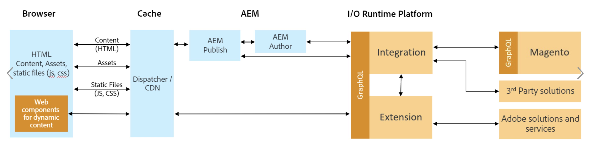

# Commerce Integration Framework Introduction

## Principles

The Commerce Integration Framework (CIF) provides our customers with adaptable Commerce business processes that are exposed as microservices:

*  Microservices are small, modular services that provide a specific business function.  

*  Easily developed and customized to complex support omnichannel scenarios and quickly adapt to changing market conditions. 

*  Reduces the time, cost, and complexity of supporting complex omnichannel commerce scenarios.

*  Supports entire marketing cloud.

## Adobe I/O Runtime

The CIF on Cloud services architecture is based on [OpenWhisk](https://openwhisk.apache.org) & [Adobe I/O Runtime](https://www.adobe.io/apis/cloudplatform/runtime.html). The main building blocks of the commerce services are serverless functions (OpenWhisk actions). These actions run on Adobe I/O Runtime inside an isolated container, stateless and serverless interacting with the commerce backend system or other endpoints via their APIs. 

## Architecture

The overall architecture is as follows:

