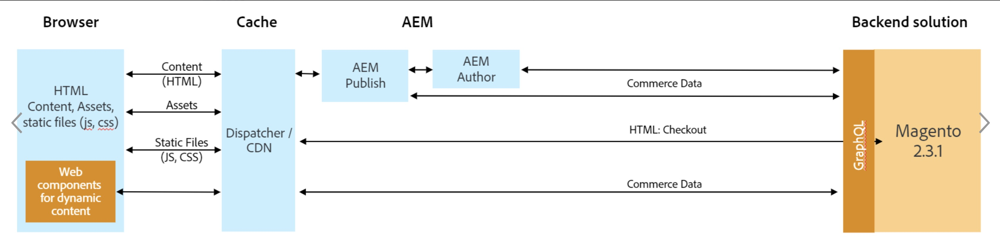

# AEM and Magento

The AEM CIF Magento connector enables AEM to access a Magento instance and bind the catalog data via GraphQL. This integration also allows AEM Authors to use product and category pickers to browse through product and category data fetched by CIF Cloud. In addition, this integration provides filtering, viewing, and browsing capabilities for AEM Authors within the Product Console in AEM.

## Architecture

The overall architecture is as follows:

## AEM Venia Reference Store-front

The AEM Venia reference store is a reference store showcasing a basic B2C commerce journey. It shouldn't be used directly, but it serves as an example for your own implementation.

It demonstrates the best practices for integrating AEM and Magento and shows how to use the Commerce Core Components. It also provides pre-sales with a reference site to demo the integration between AEM and Magento. 

The project is open source and available on[GitHub](https://github.com/adobe/aem-core-cif-components).

Both server side and client side.
### Integration patterns

## AEM Commerce connector for Magento and GraphQL

This connector provides some integration of Magento products and categories in the AEM Commerce console as well as some authoring features like product and category pickers.  It also provides authoring features to display product and category information of data stored in Magento from within AEM by using Magento's GraphQL APIs.

* The AEM Commerce console shows a hierarchal view of products stored in Magento organized by category
* The Product Picker is an AEM Dialog field, similar to the Asset Picker, that would be used with an AEM Component to allow a user to select one or more products
* The Category Picker is an AEM Dialog field, similar to the Asset Picker or Product Picker, that would be used with an AEM Component to allow an author to select one more categories.

The AEM Commerce connector is expected to be used to enhance the AEM authoring experience with a deeper integration with Magento products and categories.

It is open source on [GitHub](https://github.com/adobe/commerce-cif-connector) and you are welcome to [contribute](https://github.com/adobe/commerce-cif-connector/blob/master/.github/CONTRIBUTING.md)

Even if you have very specific use-cases, the connector can be used a reference to build additional extensions to the AEM UI, but keep in mind that any extensions to the AEM UI can have an impact on future upgrades.

## AEM Authoring

Basic components are provided, common across commerce implementations such as product, product List, navigation... They can be used as-is or be extended.

The CIF Core Components work like the [AEM Sites Core Components](https://github.com/adobe/aem-core-wcm-components) but are dedicated for the Commerce specific use-cases.

These components key benefits are:
* They are easy to use in your projects
* They can be used as-is or with very minimal modifications.
* They provide best practices for connecting with Magento via GraphQL APIs and/or via Adobe I/O.

They are open-sourced on [GitHub](https://github.com/adobe/aem-core-cif-components)
This shows full transparency on changes made going forward and allows you to get the latest version very easily. You can also provide pull requests for improvements and bug fixes that can be incorporated.
