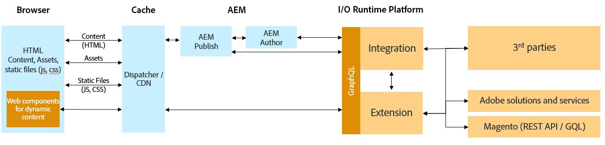

# AEM and non-Magento/3rd Party Integration using Commerce Integration Framework

The Commerce Integration Framework can also be used to integrate AEM and a non-Magento commerce backend. CIF provides elements such as an accelerator storefront, commerce core components and authoring tools that work with Magento out-of-the-box. To integreate AEM and a non-Magento backend and re-use these CIF elements, some additional development is needed. 

## Architecture

The overall architecture is as follows:

The main difference between the integration architecure for AEM-Magento and AEM-3rd Party is the addition of an integration layer as shown in the image above. The integration layer needs to be hosted on the Adobe I/O Runtime platform which is Adobe's serverless platform. The purpose of this integration layer is to map a non-Magento or a 3rd-party's APIs against Adobe Commerce APIs (Magento GraphQL APIs). This mapping allows the [AEM CIF Core Components](https://github.com/adobe/aem-core-cif-components) and [AEM CIF Connector](https://github.com/adobe/commerce-cif-connector) to retrieve data from the non-Magento solution. The advantages of using CIF elements in your project have been described in the [AEM-Magento Integration using CIF](integrations/02-AEM-Magento.md) 

To help you get started on building the required integration layer to integrate a non-Magento/3rd party solution with AEM, we have created a [reference implementation](https://github.com/adobe/commerce-cif-graphql-integration-reference) to demonstrate this. This reference can be used as a starting point in your project.
