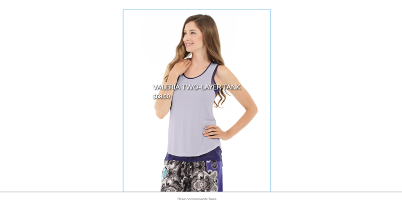

# Customize CIF Core Components

[CIF Core Components](https://github.com/adobe/aem-core-cif-components) provides a standard set of Commerce components that can be used to accelerate a project that integrates Adobe Experience Manager (AEM) and Magento solutions. These components are production ready and can be [easily styled with CSS](./04-style-cif-component.md). Many implementations will also want to extend these components to meet business specific requirements.

In this tutorial we will review several different extension points provided by CIF Core Components and AEM in general. We will do this by extending the capabilities of the [Product Teaser](https://github.com/adobe/aem-core-cif-components/tree/master/ui.apps/src/main/content/jcr_root/apps/core/cif/components/commerce/productteaser/v1/productteaser) component to include logic to render a "New" banner when the product has been created within a given time frame.

## Prerequisites

The following tools and technologies are required:

* [Java 1.8](https://www.oracle.com/technetwork/java/javase/downloads/index.html) or [Java 11](https://www.oracle.com/technetwork/java/javase/downloads/jdk11-downloads-5066655.html) (AEM 6.5+ only)
* [Apache Maven](https://maven.apache.org/) (3.3.9 or newer)
* Adobe Experience Manager (local instance)
  * [AEM 6.5](https://docs.adobe.com/content/help/en/experience-manager-65/deploying/introduction/technical-requirements.html)
  * [AEM 6.4.4+](https://docs.adobe.com/content/help/en/experience-manager-64/release-notes/sp-release-notes.html)
* Magento running a [version compatible with Archetype 0.7.0](https://github.com/adobe/aem-cif-project-archetype#requirements)

It is recommended to review the following content before proceeding with this tutorial:

* [Getting Started with AEM and Magento Integration - Video](../getting-started/01-getting-started.md)
* [Creating a new AEM CIF Project - Tutorial](../getting-started/02-new-cif-project.md)
* [Style CIF Core Components - Tutorial](./style-cif-component.md)

## Starter Project

We have provided a starter project to be used with this tutorial. The project was generated using [v0.7.0](https://github.com/adobe/aem-cif-project-archetype/releases/tag/cif-project-archetype-0.7.0) of the CIF Project Archetype. It is considered a best practice to always use the [latest release](https://github.com/adobe/aem-cif-project-archetype/releases/latest) of the archetype when starting a new project.

1. Download the starter project [**acme-store.zip**](./assets/05-customize-cif-components/acme-store.zip) to your desktop.
2. Unzip **acme-store.zip** and you should see the following folder structure:

    ```plain
    /acme-store
       /ui.content
       /ui.apps
       /samplecontent
       /core
       /all
       + pom.xml
       + README.md
    ```

3. Open a new terminal window and build and deploy the project to a local instance of AEM;

    ```shell
    $ cd acme-store/
    $ mvn clean install -PautoInstallAll
    ```

4. Add the necessary OSGi configurations to connect your AEM instance to a Magento instance by following the [Getting started with AEM and Magento Integration - Video](../getting-started/01-getting-started.md) or add the configurations to the newly created project by following the instructions in [Creating a new AEM CIF Project - Tutorial](../getting-started/02-new-cif-project.md).

5. At this point you should have a working version of a storefront that is connected to a Magento instance. Navigate to the `US` > `Home` page at: [http://localhost:4502/editor.html/content/acme/us/en.html](http://localhost:4502/editor.html/content/acme/us/en.html)

    You should see that the storefront currently is using the Venia theme. Expanding the Main Menu of the storefront, you should see various categories, indicating that the connection Magento is working.

    

## Author the Product Teaser

We will be extending the Product Teaser Component throughout this tutorial. As a first step, we will add a new instance of the Product Teaser to the Home page in order to understand the baseline functionality.

1. Navigate to the **Home Page** of the site: [http://localhost:4502/editor.html/content/acme/us/en.html](http://localhost:4502/editor.html/content/acme/us/en.html)
2. Insert a new **Product Teaser** Component into the main layout container on the page.

    

3. Expand the Side Panel (if not already toggled) and switch the asset finder dropdown to **Products**. This should display a list of available products from a connected Magento instance. Select a product and **drag+drop** it onto the **Product Teaser** component on the page.

    

    > Note, you can also configure the displayed product by configuring the component using the dialog (clicking the *wrench* icon).

4. You should now see a Product being displayed by the Product Teaser. The Name of the product and the Price of the product are default attributes that are displayed.

    

## Customizing the markup of the Product Teaser

A common extension of AEM components is to modify the markup generated by the component. This is done by overriding the [HTL script](https://docs.adobe.com/content/help/en/experience-manager-htl/using/overview.html) that the component uses to render its markup. HTML Template Language (HTL), is a lightweight templating language that AEM components use to dynamically render markup based on authored content, allowing the components to be re-used. The Product Teaser, for example, can be re-used over and over again to display different products. 

In our case we want to render a banner on top of the teaser to indicate that the product is "New" and has been recently added to the catalog. The design pattern for [customizing the markup](https://docs.adobe.com/content/help/en/experience-manager-core-components/using/developing/customizing.html#customizing-the-markup) of a component is actually standard for all AEM Components, not just for the CIF Core Components.

Use the IDE of your choice to [open the starter project downloaded](https://docs.adobe.com/content/help/en/experience-manager-learn/foundation/development/set-up-a-local-aem-development-environment.html#set-up-an-integrated-development-environment) at the beginning of the tutorial.

1. Navigate and expand the **ui.apps** module and expand the folder hierarchy to: `ui.apps/src/main/content/jcr_root/apps/acme/components/commerce/productteaser` and inspect the `.content.xml` file.

    ```xml
    <?xml version="1.0" encoding="UTF-8"?>
    <jcr:root xmlns:sling="http://sling.apache.org/jcr/sling/1.0" xmlns:cq="http://www.day.com/jcr/cq/1.0" xmlns:jcr="http://www.jcp.org/jcr/1.0"
        jcr:description="Product Teaser Component"
        jcr:primaryType="cq:Component"
        jcr:title="Product Teaser"
        sling:resourceSuperType="core/cif/components/commerce/productteaser/v1/productteaser"
        componentGroup="acme"/>
    ```

    Above is the Component definition for the Product Teaser Component in our project. Notice the property `sling:resourceSuperType="core/cif/components/commerce/productteaser/v1/productteaser"`. This is an example of creating a [Proxy component](https://docs.adobe.com/content/help/en/experience-manager-core-components/using/get-started/using.html#create-proxy-components). Instead of copying and pasting all of the Product Teaser HTL scripts from the CIF Core Components, we can use the `sling:resourceSuperType` to inherit all of the functionality.

2. Open a new browser and navigate to [CRXDE-Lite](http://localhost:4502/crx/de/index.jsp#/apps/core/cif/components/commerce/productteaser/v1/productteaser) in AEM. Expand the tree to view the `productteaser` component under: `/apps/core/cif/components/commerce/productteaser/v1/productteaser`:

    

    This is the full component definition for the Product Teaser component.

3. Switch back to your IDE and the Acme Store project. Create a new file named `productteaser.html` beneath `ui.apps/src/main/content/jcr_root/apps/acme/components/commerce/productteaser`.

4. Copy the contents of `productteaser.html` from [CRXDE-Lite](http://localhost:4502/crx/de/index.jsp#/apps/core/cif/components/commerce/productteaser/v1/productteaser/productteaser.html) and paste it into the Acme-Store project in the newly created `productteaser.html` file.

    

5. In the Acme-Store project modify the `productteaser.html` file and insert a new div that represents a badge  above the product image markup:

    ```html
    ...
    <div data-sly-test.isvalid="${product.url}" class="item__root" data-cmp-is="productteaser">
        <!-- Add Badge -->
        <div class="item__badge">
            <span>New</span>
        </div>
        <!-- end add badge -->
        <a class="item__images" href=${product.url}>
            
        </a>
        <a class="item__name" href=${product.url}><span>${product.name}</span></a>
        <div class="item__price">
            <span> ${product.formattedPrice} </span>
        </div>
        <sly data-sly-call="${actionsTpl.actions @ product=product}"></sly>
    </div>
    ```

6. Deploy the updated code to the local instance of AEM using your maven skills or using [the features of your IDE](https://docs.adobe.com/content/help/en/experience-manager-learn/foundation/development/set-up-a-local-aem-development-environment.html#set-up-an-integrated-development-environment):

    ```shell
    $ cd ui.apps
    $ mvn -PautoInstallPackage clean install
    ```

7. In the browser, return to the [Homepage of the store front](http://localhost:4502/editor.html/content/acme/us/en.html) in AEM. Refresh and you should see that a "new" Banner appears in the upper right corner of the component.

    

    Currently there is no logic behind when the banner will be displayed. In the next few exercises we will correct that.

    > Note, the CSS to render the banner was provided as part of the starter project and can be found at: `ui.apps/../apps/acme/clientlibs/theme/components/productteaser/teaser.css`. For more details checkout the [Styling CIF Core Components tutorial](./04-style-cif-component.md).

## Customizing the Dialog of the Product Teaser

Next, we will customize the dialog of the Product Teaser component to allow an Author to determine the date range for which a product is considered "new" and if the banner should be displayed. We will do this by [customizing the dialog](https://docs.adobe.com/content/help/en/experience-manager-core-components/using/developing/customizing.html#customizing-dialogs) of the Product Teaser as part of the Acme Store project.

1. Open the Acme Store project in the IDE of your choice and navigate to `ui.apps/src/main/content/jcr_root/apps/acme/components/commerce/productteaser`.

2. Beneath the `productteaser` folder, add a new folder named `_cq_dialog`. Add a new file to the `_cq_dialog` folder named `.content.xml`. You should now have the following file structure:

    ```plain
    ../acme
        /components
            /commerce
                /productteaser
                   /_cq_dialog
                      + .content.xml
                   /_cq_template
                   + .content.xml
                   + productteaser.html
    ```

3. Update `_cq_dialog/.content.xml` with the following XML:

    ```xml
    <?xml version="1.0" encoding="UTF-8"?>
    <jcr:root xmlns:sling="http://sling.apache.org/jcr/sling/1.0" 
        xmlns:cq="http://www.day.com/jcr/cq/1.0" 
        xmlns:jcr="http://www.jcp.org/jcr/1.0" 
        xmlns:nt="http://www.jcp.org/jcr/nt/1.0" 
        jcr:primaryType="nt:unstructured" 
        jcr:title="My Product Teaser" 
        sling:resourceType="cq/gui/components/authoring/dialog" 
        trackingFeature="cif-core-components:productteaser:v1">
        <content jcr:primaryType="nt:unstructured" 
            sling:resourceType="granite/ui/components/coral/foundation/container">
            <items jcr:primaryType="nt:unstructured">
                <tabs jcr:primaryType="nt:unstructured" 
                    sling:resourceType="granite/ui/components/coral/foundation/tabs" 
                    maximized="{Boolean}true">
                    <items jcr:primaryType="nt:unstructured">
                        <badge jcr:primaryType="nt:unstructured" 
                            jcr:title="Badge" 
                            sling:resourceType="granite/ui/components/coral/foundation/container" 
                            margin="{Boolean}true">
                            <items jcr:primaryType="nt:unstructured">
                                <columns jcr:primaryType="nt:unstructured" 
                                    sling:resourceType="granite/ui/components/coral/foundation/fixedcolumns" 
                                    margin="{Boolean}true">
                                    <items jcr:primaryType="nt:unstructured">
                                        <column jcr:primaryType="nt:unstructured" 
                                            sling:resourceType="granite/ui/components/coral/foundation/container">
                                            <items jcr:primaryType="nt:unstructured">
                                                <badge jcr:primaryType="nt:unstructured" 
                                                    sling:resourceType="granite/ui/components/coral/foundation/form/checkbox" 
                                                    text="Display 'New' badge" 
                                                    value="true" 
                                                    uncheckedValue="false" 
                                                    name="./badge" />
                                                <age jcr:primaryType="nt:unstructured" 
                                                    sling:resourceType="granite/ui/components/coral/foundation/form/numberfield" 
                                                    fieldDescription="The maximum age in days the 'new' badge should be shown" 
                                                    fieldLabel="Max Product Age" 
                                                    name="./age"
                                                    min="{Long}0" 
                                                    value="10" />
                                                <ageTypeHint jcr:primaryType="nt:unstructured" 
                                                    sling:resourceType="granite/ui/components/foundation/form/hidden" 
                                                    ignoreData="{Boolean}true" 
                                                    name="./age@TypeHint" 
                                                    value="Long" />
                                            </items>
                                        </column>
                                    </items>
                                </columns>
                            </items>
                        </badge>
                    </items>
                </tabs>
            </items>
        </content>
    </jcr:root>
    ```

    Above we have added 2 additional fields as part of a new tab and a single hidden field.

    1. Checkbox to Display 'New' badge
    2. Number field to define the Max Product Age
    3. Hidden field to ensure that the Max Product Age is saved as a long (see [@TypeHint](https://sling.apache.org/documentation/bundles/manipulating-content-the-slingpostservlet-servlets-post.html) for more details)

    Dialogs defined as part of a proxy component inherit all of the existing dialog fields with a feauture known as [Sling Resource Merger](https://helpx.adobe.com/experience-manager/6-4/sites/developing/using/sling-resource-merger.html). Therefore we con't have to re-define the existing fields that are part of the Product Teaser.

4. Update `productteaser.html` and add a `data-sly-test` to the `<div>` for the badge. This will be a simple test to decide to render the badge if the user has checked "true".

    ```html
        ...
        <div data-sly-test.isvalid="${product.url}" class="item__root" data-cmp-is="productteaser">

            <!--/* add test to see if properties.badge equals true */-->
            <div data-sly-test="${properties.badge == 'true'}" class="item__badge">
                <span>New</span>
            </div>
    ...
    ```

5. Deploy the updated code to the local instance of AEM using features of your IDE or by using your maven skills:

    ```shell
    $ cd ui.apps
    $ mvn -PautoInstallPackage clean install
    ```

6. Return to the Product Teaser component and click the *wrench* icon to open the Dialog. You should now see a tab for **Badge** with two additional fields. Updating these fields will persist the values to AEM. You should be able to toggle on/off the badge with the checkbox:

    

    This gives the author some control over when the badge appears. However it would be ideal for the badge to dissappear automatically once the product has reached a certain age in days. For this we will need to implement some backend logic.


